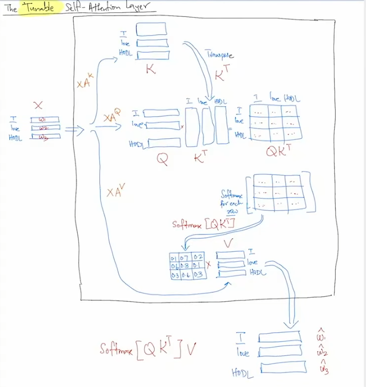
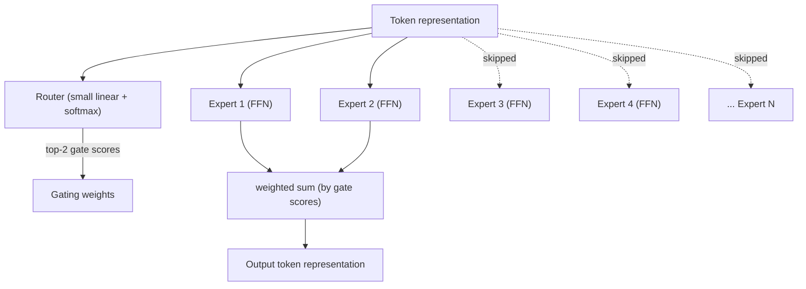

# Transformer Fundamentals: Tokenization, Attention, Normalization & Sparsity
---

## 1. Tokenization: the step before embeddings

Raw text must first become a finite list of discrete tokens mapped to integer IDs before any embedding lookup can happen — this step is where the vocabulary itself comes from.

### 1.1 Why not just use words or characters?

- **Word-level vocab**: explodes in size (millions of words counting morphology, typos, names), and any unseen word becomes `<UNK>` — permanent information loss.
- **Character-level vocab**: tiny vocabulary, but sequences become very long (a 20-word sentence → ~100+ tokens), which is expensive since attention cost is quadratic in sequence length (§3.4).

**Subword tokenization** is the compromise: common words stay whole, rare words split into meaningful chunks ("unhappiness" → "un" + "happi" + "ness").

### 1.2 Byte-Pair Encoding (BPE) — how GPT-family models tokenize

BPE is not language-aware — it's a **compression algorithm** repurposed for tokenization, driven purely by frequency statistics.

**Algorithm:**
1. Start with individual characters (or bytes, in GPT-2/GPT-4's *byte-level* BPE — this guarantees no `<UNK>` token ever, since any byte sequence is representable).
2. Count every adjacent pair of symbols in the training corpus.
3. Merge the **most frequent pair** into a new symbol; add it to the vocabulary.
4. Repeat 2–3 until reaching a target vocab size (e.g., 50k for GPT-2, ~100k for GPT-4).

**Worked example** (toy corpus: "lower" frequent, "lowest" frequent):

```
Initial (character level):
l o w e r </w>     (freq 5)
l o w e s t </w>    (freq 3)

Step 1 — most frequent pair: ("l","o") → merge into "lo"
lo w e r </w>
lo w e s t </w>

Step 2 — most frequent pair: ("lo","w") → merge into "low"
low e r </w>
low e s t </w>

Step 3 — most frequent pair: ("e","s") appears, but also ("e","r") — pick whichever
count is higher (say "e","r" wins because "lower" is more frequent)
low er </w>
low e s t </w>

... continue until vocab budget is exhausted.
```

Result: "lower" → `[low, er]`, "lowest" → `[low, e, s, t]` (or fewer pieces if "est" also got merged). Common words become single tokens; rare/novel words fall back to smaller, still-meaningful pieces.

**Non-obvious tweak**: merge order is **greedy and frequency-driven, not linguistically informed** — this is why tokenizers sometimes split things in surprising ways (e.g., GPT-2's historic `" SolidGoldMagikarp"`-style glitch tokens came from rare Reddit-username artifacts frequent enough in the tokenizer's training corpus to earn a token, but too rare during actual LM training to get a well-trained embedding — causing bizarre model behavior when the token appeared).

### 1.3 WordPiece — how BERT-family models tokenize

Similar to BPE — both build subwords bottom-up — but differs in **how the merge pair is chosen**.

**Algorithm:**
1. Start with individual characters (or initial subword units).
2. Evaluate adjacent pairs in the corpus.
3. Score each pair by how strongly its two tokens co-occur relative to their individual frequencies: a simplified form is `count(xy) / (count(x) × count(y))`.
4. Merge the pair with the **highest score**.
5. Repeat until the target vocab size is reached.

### 1.4 Unigram Language Model — How It Works

Opposite direction from BPE/WordPiece: start with a **large** vocabulary of candidate subwords and progressively **remove** the tokens that contribute least to the training data's likelihood.

### Example

```text
lowest
The initial vocabulary may contain:
{ l, o, w, e, s, t,
  lo, low, est, west, lowest, ... }
This gives multiple possible segmentations:
lowest
├── [lowest]
├── [low, est]
├── [lo, west]
└── [l, o, w, e, s, t]
The model assigns probabilities to tokens and uses them to evaluate different segmentations.
P([lowest])      = 0.02
P([low, est])    = 0.35
P([lo, west])    = 0.10
P([l,o,w,e,s,t]) = 0.01
So the model prefers:
lowest → [low, est]
and remove "lowest"
```

- **BPE** → merge the most frequent pairs (greedy compression)
- **WordPiece** → merge pairs with the strongest likelihood-oriented score
- **Unigram LM** → start with many candidate subwords, remove the least useful while preserving corpus likelihood

> Only after this step does the token ID get passed to an embedding lookup table (`embedding_matrix[token_id]`) to produce the vector the transformer actually operates on.

---

## 2. Positional Encoding

Self-attention has no built-in sense of order, so a positional signal must be injected. Two fundamentally different approaches:

- **Absolute schemes** (§2.1) — compute a fixed representation of "this is position 7" and add it to the token embedding once, at the input.
- **Relative schemes** (§2.2) — never compute a position in isolation; instead, inject "these two tokens are 3 apart" at the moment attention compares a query to a key.

Absolute schemes came first; relative schemes were developed to fix their weaknesses.

### 2.1 Absolute positional encoding

Each position gets a fixed vector, computed independently of other tokens, added to the token embedding at the input. Two implementations:

#### 2.1.1 Learned absolute positional embeddings (BERT, GPT-2)

Instead of a formula, the model learns a table `position_embedding[0..max_len]`, added to the token embedding — a second vocabulary indexed by position.
**Weakness:** undefined past `max_len`, so the model **cannot process longer sequences at all** — a hard cutoff.

#### 2.1.2 Sinusoidal encoding (original "Attention is All You Need")

>$PE(pos, 2i) = \sin\left(\frac{pos}{10000^{2i/d_{\text{model}}}}\right)$

>$PE(pos, 2i+1) = \cos\left(\frac{pos}{10000^{2i/d_{\text{model}}}}\right)$

**Frequencies.** Index $i$ selects a dimension pair, each pair using a different sinusoidal frequency; as $i$ increases the wave slows and its period lengthens. Lower frequencies capture fine-grained positional changes, higher frequencies capture slower, long-range patterns — combined, they give each position a distinctive multi-scale fingerprint.

**Why sinusoids over a learned table (both were tested)?** Relative shifts have a consistent mathematical structure under sinusoids: shifting by the same distance $k$ produces the same transformation regardless of starting position.

**Weakness:** extrapolation in practice is much weaker than the theory suggests — the model was never trained on those longer distances.

*(Implementation note: the token embedding is scaled by √d_model before adding PE, so the bounded [-1,1] sinusoid neither swamps nor is swamped by the embedding's own scale.)*

### 2.2 Relative positional encoding: one family, two mechanisms

Instead of computing a position in isolation and adding it at the input (§2.1), relative schemes inject "these two tokens are `k` apart" directly at attention time. Four designs matter, best split by **mechanism**: three inject a bias into the **score** after `QKᵀ`; one (RoPE) instead **rotates `Q`/`K` before** the dot product.

#### 2.2.1 Score-bias schemes: Transformer-XL, T5, ALiBi

All three leave `Q` and `K` untouched and add something directly to the raw attention score, just before the softmax:

| Scheme | What's added to the score | Learned or fixed? |
|---|---|---|
| **Transformer-XL** (Dai et al., 2019) | A term decomposed from relative distance `(i−j)`, via a learned embedding indexed by that distance | Learned |
| **T5** (Raffel et al., 2020) | A single scalar per (attention head, relative-distance **bucket**) — nearby distances get their own bucket, distant ones share progressively wider buckets so the table stays bounded | Learned |
| **ALiBi** (Press et al., 2021; BLOOM, MPT) | `−m · (i−j)`, a straight-line penalty growing with distance; `m` is a fixed, head-specific slope | **Fixed** — no learned parameter |

T5 drops positional info from the token embeddings entirely and relies solely on this score bias (used in both encoder and decoder self-attention — see `04-encoder-decoder-architecture.md` §8). ALiBi is the simplest and remains widely used because its fixed formula needs **no interpolation tricks** to handle sequences longer than any seen in training — it was proposed specifically for this length-extrapolation property.

#### 2.2.2 RoPE (Rotary Positional Embeddings) — the one that rotates instead

RoPE (LLaMA, Mistral, GPT-NeoX-style models) takes the only mechanically distinct route: it **rotates** Q and K by an angle proportional to position, *before* the dot product — nothing is added to the score afterward.

It doesn't rotate the whole `d_k`-dim vector by one angle — it **pairs up dimensions** — `(x_0,x_1)`, `(x_2,x_3)`, … — rotating each pair by its own angle at frequency `θ_t` (same "low dims oscillate fast, high dims oscillate slow" pattern as sinusoidal encoding, §2.1.2):

```
θ_t = 10000^(−2t/d_k)                for pair index t = 0, ..., d_k/2 − 1

q'_i rotated by (i·θ_t), k'_j rotated by (j·θ_t), per pair

q'_i · k'_j, summed over all pairs, depends only on (i − j) — this falls out of how
rotations compose, not from anything the model has to learn
```

**Why rotate instead of biasing the score?** Baking relative position into the dot product itself is a clean mathematical consequence of rotation rather than something the model must *learn* to infer from two separately-added absolute vectors — this tends to generalize better to lengths not exactly seen in training.

**Why the multiple frequencies matter**: long-context extension tricks ("RoPE scaling" / NTK-aware scaling) work by stretching or interpolating the per-pair frequencies `θ_t` to adapt an already-trained model to longer contexts — possible only because there's a whole spectrum of frequencies to interpolate across, unlike a single global angle or a fixed learned table with no entries past `max_len` (§2.1.1). `03-decoder-only-architecture.md` §8 covers the serving-side consequences.

---

## 3. Self-Attention: the actual mechanism

### 3.1 Query, Key, Value — the intuition before the math

Every token produces three projections of itself:
- **Query (Q)**: "what am I looking for?"
- **Key (K)**: "what do I contain, that others might look for?"
- **Value (V)**: "what information do I actually pass along if someone attends to me?"



### 3.2 The formula

```
Attention(Q, K, V) = softmax( Q Kᵀ / √d_k ) V
```

### 3.3 The scaling trick most people can quote but can't explain: why `√d_k`?

- `Q` and `K` entries are (roughly) independent random variables with mean 0, variance 1, under reasonable initialization.
- The dot product `q · k = Σ (q_i * k_i)` over `d_k` dimensions has **variance growing linearly with `d_k`** (variances of independent terms sum).
- For large `d_k` (e.g., 64 or 128), raw dot products can have large magnitude — some much bigger than others purely from dimensionality, not "true" relevance.
- Feeding large-magnitude, high-variance numbers into `softmax` pushes it into a saturated regime (one entry ≈1, rest ≈0), **killing gradient flow** during training.
- Dividing by `√d_k` renormalizes variance back to ≈1 regardless of dimension, keeping softmax well-behaved and differentiable.

A pure numerical-stability trick, not a modeling assumption — a detail buried in a single footnote of the original paper but skipped in most tutorials.

### 3.4 The quadratic cost nobody loves

Computing `Q Kᵀ` is an `(n × d_k) × (d_k × n)` matmul → **O(n² · d_k)** cost, `n` = sequence length. This is *the* reason long-context models are hard and expensive, and why linear attention, sliding-window attention, FlashAttention, and state-space models (Mamba) all exist to attack this term.

**What FlashAttention actually changes** (the math is identical — output is numerically the same attention computation): a naive implementation computes the full `n×n` score matrix, writes it to slow GPU memory (HBM), reads it back for softmax, writes the result again, then reads it once more for the final multiply by `V` — most wall-clock cost is this repeated memory traffic, not the arithmetic. FlashAttention instead processes `Q`, `K`, `V` in small **tiles** that fit in the GPU's fast on-chip SRAM, computing partial attention outputs per tile and never materializing the full `n×n` matrix in slow memory.

**The technical challenge:** softmax normally needs the sum over an entire row before producing a result, but tiling only reveals one piece of the row at a time. FlashAttention solves this with an **online softmax**: it keeps a running (max, sum) pair, updates it as each tile arrives, and rescales previously computed partial outputs whenever a larger value appears — mathematically identical to computing softmax over the full row at once, no approximation.

### 3.5 Multi-Head Attention — why not just one big attention operation?

```
head_i = Attention(Q W_Q^i, K W_K^i, V W_V^i)
MultiHead(Q,K,V) = Concat(head_1, ..., head_h) W_O
```

```
d_model = 512, h = 8 heads → each head operates in a 64-dim subspace

┌─────────────── d_model = 512 ───────────────┐
│ head1 │ head2 │ head3 │ ... │ head7 │ head8 │   (each 64-dim)
└───────┴───────┴───────┴─────┴───────┴───────┘
   ↓        ↓        ↓            ↓        ↓
 syntax   coref   position     rare-tok  long-range
 (illustrative — heads are NOT hand-assigned these roles,
  they emerge from training and are often polysemantic/overlapping)
```

**Why**: a single attention operation is forced to average all relationship types (syntactic, positional, semantic, coreference-like) into one weighted sum. Multiple smaller heads let each specialize in a different relationship type, and concatenation combines several "views" of the sequence instead of one blurred average.

### 3.6 Padding masks — a second, more mundane kind of masking that applies everywhere

- In batched training, sequences differ in length, so shorter ones are padded with `<PAD>` tokens.
- `<PAD>` carries no information, so it must **not receive attention** and **must not contribute to the loss**.
- Before softmax, attention scores involving padding positions are set to **−∞**, making their weight exactly **0**.
- Padding masking is **orthogonal to architectural masking**:
  - Encoder: padding mask
  - Decoder: causal + padding mask
  - Cross-attention: padding mask on the encoder side

**Key idea:** padding masks handle **batching**; causal/architectural masks control **information flow**.

---

## 4. The Residual Stream & Normalization — from first principles to Pre-LN vs Post-LN

Transformer diagrams bundle two different ideas into one "Add & Norm" box. Pulled apart:

- §4.1 — **"Add"**: the residual connection, and why deep networks need it.
- §4.2 — **"Norm"**: normalization, and why activations need rescaling at all.
- §4.3 — how the two combine, and the two questions that remain.
- §4.4–§4.7 — *what* exactly "Norm" computes: BatchNorm vs LayerNorm, then RMSNorm.
- §4.8 — *where* exactly "Norm" sits relative to "Add": Post-LN vs Pre-LN.
- §4.9 — dropout, the last regularizer touching this same residual stream.

### 4.1 Idea #1 — the residual (skip) connection: why "add x back"?

A block doesn't simply replace its input with the sub-layer's output — it adds the original input back:
```
output = x + SubLayer(x)          (instead of just output = SubLayer(x))
```
That `+x` is the **residual connection** ("skip connection"). It addresses two problems:

**1. Information degradation:** each layer transforms the previous layer's representation; as transformations accumulate, original information can be progressively degraded even when it should be preserved.

**2. Gradient degradation:** during backprop, gradients pass through many transformations and can become very small or unstable, making deep networks harder to optimize.

**Why `+x` fixes this.** A sub-layer only has to learn a *correction* on top of `x`, not `x` itself — if unhelpful for a given input, it can learn to output near-zero and `x` passes through almost unchanged. During backprop this gives a direct, additive gradient path: `∂output/∂x = 1 + ∂SubLayer(x)/∂x`. That standalone `1` guarantees the gradient never fully vanishes, no matter how many layers it crosses — a literal shortcut for gradients, not just a conceptual one.

### 4.2 Idea #2 — normalization: why rescale activations at all?

A separate problem from §4.1: as data flows forward through a deep network, activation **scale and spread can drift** — some layers produce very large values, others very small, and the drift itself shifts as training proceeds and weights change.

Left unchecked, this causes:
- Large-magnitude values feeding `softmax` (§3.3) can push it into saturation with near-zero gradients, stalling training.
- Every layer's ideal learning rate depends on the scale of what it receives; if that scale keeps shifting, one global learning rate must chase a moving target, slowing and destabilizing training.

**Normalization's job**: rescale (and often re-center) a vector of activations to a controlled, predictable mean and variance regardless of what happened upstream — so every layer sees well-behaved inputs no matter its depth or how far training has drifted the surrounding weights.

This does **not** replace the residual connection — the two solve different problems (gradient flow *across depth* vs. activation *scale within a layer*) and are almost always used together, hence "Add & Norm."

### 4.3 Putting them together: "Add & Norm"

Every sub-layer (self-attention or FFN) is wrapped in the same pattern:
```
Add  → the residual connection (§4.1):  x + SubLayer(x)
Norm → the normalization step (§4.2):   rescales the result — or the input, depending on
                                          where it's placed, see §4.8
```
Two open questions, answered in order:
1. **What** exactly does "Norm" compute — over which axis, using which statistics? → §4.4–§4.7.
2. **Where** exactly does "Norm" sit relative to "Add"? → §4.8 — this matters enormously for how deep a model can be trained, not just a cosmetic ordering choice.

### 4.4 What exactly gets normalized: BatchNorm vs LayerNorm

```
BatchNorm: Normalizes across tokens/examples, separately for each feature.
          For a given feature dimension, BatchNorm computes the mean 
          and variance using values from multiple examples in the batch 
          (and, depending on the implementation, potentially across sequence positions as well).

LayerNorm: Normalizes across the features of each individual token representation.
           For a given token vector, LayerNorm computes the mean and variance using all 
           feature dimensions within that vector, independently of the other tokens and examples in the batch.

Tensor shape: [batch, sequence_length, d_model]

BatchNorm axis:                     LayerNorm axis:
   ┌─────────────┐                     ┌─────────────┐
   │ b1 b2 b3 b4 │ ← normalize         │ f1 f2 f3 f4 │ ← normalize
   │ ↕  ↕  ↕  ↕  │   down this         │ ←────────→  │   across this
   │ (per feature,│   column           │ (per token,  │   row
   │  over batch) │                    │  over features)│
   └─────────────┘                     └─────────────┘
```

BatchNorm is not commonly used in Transformers because:
1. **Variable-length sequences**: batches contain sentences of different lengths, padded to the max. BatchNorm statistics computed "per timestep, across the batch" get contaminated by padding, or become meaningless/undefined for positions few sequences in the batch reach.
2. **Train/inference statistics mismatch**: BatchNorm relies on running averages of training-time batch statistics, applied at inference. Autoregressive generation often processes one sequence at a time (or batch size 1) — batch statistics become meaningless or unstable at small/singleton batches.

### 4.5 RMSNorm — the cheaper cousin used in essentially every modern LLM

LayerNorm does two separate things to a token vector `x`, and only one earns its keep:
```
LayerNorm(x) = ( (x − mean(x)) / sqrt(var(x) + ε) ) ⊙ γ + β
                    ─────┬─────    ──────┬──────
                 re-centering      re-scaling
              (subtract the mean)  (divide by the spread)
```

**The empirical finding that motivated RMSNorm** (Zhang & Sennrich, 2019): LayerNorm variants that keep re-scaling but drop re-centering retain almost all of LayerNorm's stability benefit — nearly all the benefit comes from **re-scaling invariance** (keeping the vector's magnitude well-behaved regardless of upstream weight-matrix scale); mean-subtraction contributes little on its own, making it a candidate to cut.

**RMSNorm's formula** — drop mean subtraction and the learned bias `β`, keep only rescaling by the root-mean-square and a learned gain `γ`:
```
RMS(x) = sqrt( (1/d) · Σ x_i²  +  ε )

RMSNorm(x) = (x / RMS(x)) ⊙ γ
```
Compared to LayerNorm: no `mean(x)` reduction, no subtraction step, no additive bias `β` — just one reduction (sum of squares) and one elementwise multiply.

### 4.8 Where exactly the norm sits inside a block — Post-LN vs Pre-LN

The "they moved the normalization from one place to another and it mattered a lot" story.

**Post-LN (original 2017 Transformer):**
```
x → Self-Attention → (+x, residual) → LayerNorm → FFN → 

      ┌─────────────┐
 x ──►│ Self-Attn   │
 │    └──────┬──────┘
 │           ▼
 └─────────►(+)
             │
             ▼
        [LayerNorm]   ← normalization AFTER the residual add
             │
             ▼
       (same pattern repeats for FFN)
```

**Pre-LN (GPT-2 onward, most modern LLMs):**
```
x → LayerNorm → Self-Attention → (+x, residual) → FFN 

 x ──┬────────────────────────────────►(+)
     │                                  ▲
     ▼                                  │
[LayerNorm]                             │
     │                                  │
     ▼                                  │
 Self-Attn ─────────────────────────────┘
        (normalization happens BEFORE entering the sub-layer,
         and the residual stream itself is never normalized)
```

**Why this move happened:** Post-LN normalizes after the residual add, repeatedly rescaling gradients as they flow backward through layers, causing instability at depth — it needs careful LR warmup to train past ~12–24 layers (LR **increases linearly** for `warmup_steps`, then **decays proportionally to the inverse square root of the step number**).

Pre-LN normalizes before the sub-layer, leaving the residual stream itself untouched — giving gradients a clean path back to the input, making deep training far more stable and reducing the need for warmup.

**Tradeoff:** Pre-LN's residual stream can grow large in norm over depth, slightly hurting final performance vs. a well-trained Post-LN model. Fixes like Sandwich-LN or an extra final norm address this.

### 4.9 Dropout — the regularizer that's easy to forget about because it "just sits there"

The original Transformer applies **dropout** (randomly zeroing a fraction of values during training, scaling the rest to compensate, and disabled entirely at inference) at several easy-to-overlook points:

- **Embedding dropout**: right after summing token + positional embeddings, before the first block.
- **Attention-weight dropout**: applied to the softmax output `α_ij` (§3) before multiplying by `V` — some attention connections are randomly dropped even after softmax.
- **Residual/sub-layer dropout**: applied to each sub-layer's output (self-attention or FFN) *before* it's added back into the residual stream.

---

## 5. Feed-Forward Network (FFN) and where the parameters actually live

Each block contains a position-wise FFN, applied independently to every token:
```
FFN(x) = W2 · activation(W1 · x + b1) + b2
```
The hidden dimension is typically **4× `d_model`** (e.g., `d_model=768 → d_ff=3072` in BERT-base), then projected back down.

### 5.1 The parameter-count surprise (and a caveat about when it stops holding)

Attention is the "famous" mechanism, so most assume it holds most of a Transformer's parameters. Under standard multi-head attention (§3.5), it doesn't:
```
Per-block parameter count (roughly, ignoring biases), standard MHA:

Attention (Q,K,V,O projections):   4 × d_model²
FFN (up-projection + down-proj):   2 × d_model × d_ff  =  2 × d_model × (4·d_model) = 8 × d_model²

                Attention : FFN   ≈   4 : 8   =   1 : 2
```

### 5.2 SwiGLU — a gated activation that replaced plain ReLU/GELU in most modern LLMs

The formula above applies one activation elementwise to a single linear projection. **Gated Linear Units (GLUs)** — an older idea from gated architectures like LSTMs — instead compute **two** separate linear projections of the same input, run an activation on one, and use it to elementwise-**gate** (multiply into) the other:
```
GLU(x) = (activation(x W1)) ⊙ (x V)         ⊙ = elementwise multiply
```
**SwiGLU** uses the **Swish** (a.k.a. **SiLU**) activation, `Swish(z) = z · sigmoid(β·z)`, as the gate:
```
SwiGLU-FFN(x) = ( Swish(x W1) ⊙ (x V) ) W2
```
**Why it's better**: the gate is a learned function of the input itself, so the network can open/close each channel per-token instead of applying a fixed activation uniformly — more flexibility.

**Cost**: needs 3 matrices (W1, V, W2) instead of 2, so `d_ff` is shrunk by ~2/3 to keep total parameters constant (as LLaMA does).

---

## 6. Mixture of Experts (MoE) — making the FFN sparse

### 6.1 The idea

Instead of one dense FFN every token passes through, use N parallel expert FFNs plus a small router that picks the top-k experts per token (e.g., Mixtral 8x7B uses top-2 of 8).



### 6.2 Why this matters

- Total params can be huge (Mixtral: ~47B), but active params per token stay small (~13B) — capacity of a big model at the inference cost of a small one. (Still needs enough VRAM to hold all experts, since any token could route anywhere — this trades compute for memory.)
- **Load balancing**: without an auxiliary loss penalizing imbalance, the router collapses onto a favorite few experts. Switch Transformer and Mixtral both add an explicit load-balancing loss to fix this.
