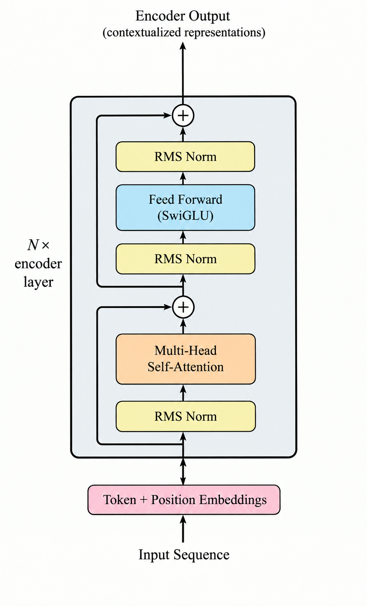

# Encoder-Only Transformers (BERT-style)


## 1. The core change: one stack, no masking, nothing else attached

An encoder-only model (BERT, RoBERTa, ELECTRA, DeBERTa) stacks `N` copies of the block from the fundamentals file — self-attention followed by a position-wise FFN, each wrapped in residual + norm (fundamentals file §3, §5–§6) — with nothing before or after except embeddings in and a task-specific head out.





## 2. what to use for?
Encoder-only models are built for **understanding** — producing a rich representation of text for classification, similarity, retrieval, or feature extraction. There's no output sequence to generate, so the generation apparatus is entirely absent.

## 3. Bidirectionality is the entire point (and the entire limitation)

```
Bidirectional attention pattern (contrast with the causal
triangle mask you'll meet in `03-decoder-only-architecture.md` §2):

          tok1  tok2  tok3  tok4
  tok1  [  ✓     ✓     ✓     ✓  ]
  tok2  [  ✓     ✓     ✓     ✓  ]
  tok3  [  ✓     ✓     ✓     ✓  ]
  tok4  [  ✓     ✓     ✓     ✓  ]        ← fully dense, no masking at all
```

**The direct cost of this**: a model trained to always see both left and right context **cannot be used for free-form autoregressive generation** — at generation time the "right context" doesn't exist yet by definition. This is precisely why BERT-family models are not used as chatbots/text-generators, and why the field split into encoder-only (understanding) vs decoder-only (generation) families rather than everyone just using one architecture for everything.


### 4 Masked Language Modeling (MLM)

- Randomly select ~15% of input tokens.
- Of those: 80% get replaced with a literal `[MASK]` token, 10% get replaced with a
  random other token, 10% are left unchanged.
- Train the model to predict the **original** token at each of those selected positions,
  using the (now bidirectional) context around it.

```
Input:  The  cat  [MASK]  on   the   mat
Target:  -    -    "sat"   -    -     -     (loss computed only at the masked position)
```

## 5. The `[CLS]` token — a purely architectural convention, not a mechanism

BERT prepends a special `[CLS]` token to every input. Because of full bidirectional attention, this token's final-layer representation ends up being influenced by *every* token in the sequence — so by convention, it's used as a stand-in "summary vector" for the whole sequence, fed into a small classification head for sentence-level tasks. There is nothing architecturally special about `[CLS]` itself (it's just another token embedding); it earns its role purely by convention and by what it's trained against (e.g. the NSP task in original BERT specifically trained a classifier on top of `[CLS]`).
