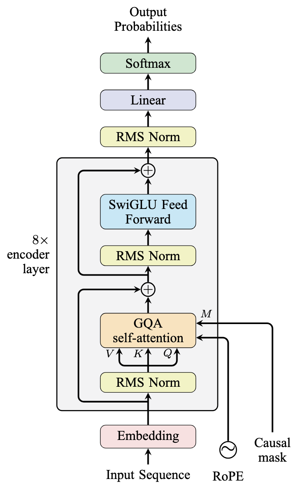
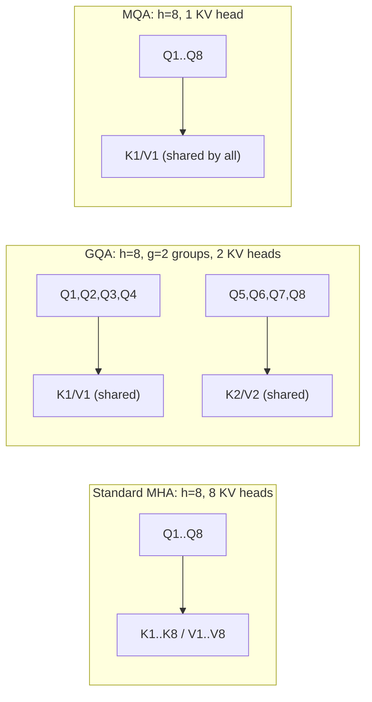

# Decoder-Only Transformers (GPT-style)

## 1. The core change: same block as the encoder, but with one crucial difference — masking

A decoder-only model (GPT-2/3/4, LLaMA, Mistral, PaLM) reuses the exact same
block shape you already saw in `02-encoder-only-architecture.md` (self-attention +
FFN, wrapped in residual + norm), **minus bidirectionality**. Each block has exactly two
sub-layers:




## 2. Masked (causal) self-attention — the first mask you've seen

The encoder-only file used the *exact same* self-attention formula from the
fundamentals file with **no mask at all** — every token could see every other token.
Here, the model is only allowed to look **backward**: position `i` can attend to
positions `≤ i`, never to anything after it (a "look-ahead mask").

```
Causal mask (✓ = allowed to attend, ✗ = masked out) for a 4-token sequence:

          tok1  tok2  tok3  tok4
  tok1  [  ✓     ✗     ✗     ✗  ]
  tok2  [  ✓     ✓     ✗     ✗  ]
  tok3  [  ✓     ✓     ✓     ✗  ]
  tok4  [  ✓     ✓     ✓     ✓  ]
```

Contrast this directly with the fully-dense, no-masking-at-all grid from
`02-encoder-only-architecture.md` §3 — same attention mechanism, same formula, the
*only* difference is which cells are allowed to be non-zero after the softmax.

**Mechanically**, the mask is enforced by setting every disallowed entry of `QKᵀ` to
`-∞` before the softmax, so those positions become exactly 0 attention weight after
softmax — the model can compute the full `n×n` score matrix in one shot and just zero
out the upper triangle, rather than needing any special sequential logic.

**Two separate things are going on here, and it's easy to blur them into one:**

- **Teacher forcing** is a *training-data* choice: at every position, the model is fed
  the ground-truth previous tokens as input, regardless of what the model itself would
  have predicted at that position. This is what lets you compute a loss at every
  position of a sequence in one pass, using the real, correct history rather than the
  model's own (possibly wrong) earlier guesses.
- **The causal mask** is a *computation* constraint: it's what makes it safe to feed the
  entire teacher-forced sequence into the model **in parallel**, in a single forward
  pass, instead of one position at a time — without it, letting the model see the whole
  sequence at once would let position `i` peek at the token it's supposed to be
  predicting.

At **inference time**, this mask is automatically satisfied anyway, since tokens are
generated one at a time and future tokens simply don't exist yet to attend to.

## 3. Why decoder-only ended up dominating general-purpose LLMs

Encoder-decoder architectures are ideal for fixed input → different output tasks such as translation.
However, most modern LLM tasks—chat, QA, code completion, summarization, and few-shot learning—can naturally
be represented as one continuous token sequence.

A decoder-only model unifies these tasks through a single objective: next-token prediction.
Prompting turns different tasks into "continue this text," while training can use large amounts of raw, unpaired text.

Decoder-only models also avoid the cost of a separate encoder stack and cross-attention,
making the architecture simpler and more efficient.

---

## 4. KV Cache — why generation doesn't recompute everything at every step

### 4.1 The redundant-work problem

- At inference, tokens are produced one at a time, meaning each new token would otherwise
  require the whole sequence to be fed and recomputed all over again through the transformer.
- But the causal mask guarantees that past tokens can't be affected by future ones,
  hence the past K and V stays the same through the whole sequence.

### 4.2 The fix: cache K and V, only compute what's new
The **KV cache** stores every past token's Key and Value vectors (per layer, per head)
the first time they're computed. On each new generation step, the model only has to
compute Q, K, V for the **single new token**, append its K and V onto the cache, and run
attention of that one new query against *all* cached keys/values (old + new):

```
Step 1: generate tok1  → compute K1,V1 → cache = [K1,V1]
Step 2: generate tok2  → compute K2,V2 → cache = [K1,V1, K2,V2]
                          attend: Q2 against (K1,K2) / (V1,V2)
Step 3: generate tok3  → compute K3,V3 → cache = [K1,V1, K2,V2, K3,V3]
                          attend: Q3 against (K1,K2,K3) / (V1,V2,V3)
        (K1,V1 and K2,V2 are never recomputed — only ever read from the cache)
```
$$
C_{\text{no-cache}} = \frac{N(N+1)}{2}
$$

$$
C_{\text{cache}} = N
$$

$$
\text{Saving \%}
=
\left(1-\frac{C_{\text{cache}}}{C_{\text{no-cache}}}\right)\times100
$$

$$
\boxed{
\text{Saving \%}
=
\frac{N-1}{N+1}\times100
}
$$


### 4.3 The tradeoff nobody mentions until they hit it: memory, not compute

The cache isn't free — it has to be held in GPU memory for the entire generation, and its
size scales as:

```
KV cache size  ∝  2 (K and V)  ×  num_layers  ×  num_KV_heads  ×  head_dim
                   ×  sequence_length  ×  batch_size  ×  bytes_per_value
```


## 5. Multi-Query / Grouped-Query Attention (MQA / GQA) — shrinking the KV cache

### 5.1 Where the KV cache's size actually comes from

In standard multi-head attention (fundamentals file §3.5), **every** head has its own
independent K and V projection matrices — `h` heads means `h` separate sets of Keys and
Values to store in the cache from §5. That `num_KV_heads` factor in the cache-size formula
above is normally just `h`, the same as the number of query heads.

### 5.2 Multi-Query Attention (MQA) — one shared K/V for every query head

Shazeer's original proposal (2019): keep `h` separate **query** heads (so the model still
gets multiple "views" when deciding *what* to attend to), but collapse all of them down to
a **single, shared** Key projection and a single shared Value projection, reused by every
query head:

```
Standard MHA:  h separate (Q,K,V) triples          → cache stores h K/V pairs
MQA:           h separate Q's,  ONE shared (K,V)    → cache stores  1  K/V pair
```

This shrinks the KV cache by roughly a factor of `h` (e.g. 32× for a 32-head model) — a
huge win for serving cost — at the price of some quality loss: every query head is now
forced to search the *same* Key/Value representation, losing the specialization that
having independent K/V projections per head allowed.

### 5.3 Grouped-Query Attention (GQA) — the middle ground actually used today

GQA (Ainslie et al., 2023 — used in LLaMA-2 70B, LLaMA-3, Mistral) generalizes both
extremes: split the `h` query heads into `g` groups, and give each **group** its own
shared K/V head (instead of either "one K/V per query head" or "one K/V total"):

```
g = h   →  standard Multi-Head Attention (no sharing)
g = 1   →  Multi-Query Attention (full sharing)
1<g<h   →  Grouped-Query Attention  (e.g. 32 query heads sharing only 8 KV heads)
```



**Why this specific middle ground won out in practice**: empirically, most of the KV
cache's memory savings can be captured by shrinking the *number* of distinct KV heads
quite aggressively (e.g. 32 query heads down to 8 KV heads) with quality nearly matching
full MHA — the redundancy that MQA over-corrected for is mostly real, but *not* so total
that a single shared K/V for the whole model is optimal. GQA lets teams pick a point on
the memory-vs-quality curve instead of being stuck at either extreme, which is why it,
not plain MQA, became the default choice for essentially every serving-optimized LLM
released after 2023.

**Side effect worth noting**: shrinking the K/V projection matrices this way is also
exactly what pulls the fundamentals file's §5.1 attention:FFN parameter ratio further
away from `1:2` — fewer, smaller K/V matrices means an even smaller attention-side
parameter count relative to the (unchanged) FFN.

## 6. Context Window — what it actually bounds, and why it isn't free to extend

**Definition:** The maximum number of tokens the model can handle at once, including **prompt + generated tokens**.

A larger context is limited by two main factors:

1. **Position limit**

   * Learned absolute embeddings have a hard `max_len`.
   * RoPE/ALiBi can extend beyond their training range, but quality may degrade.
   * **RoPE scaling** can extend the effective context without full retraining.

2. **Compute & memory**

   * Attention has `O(n²)` cost.
   * KV cache grows **linearly with context length**, increasing GPU memory and bandwidth usage.
   * This makes long contexts expensive, especially with many concurrent requests.

### Why it matters

A larger context is not simply "better" — it increases serving cost. Techniques such as **sliding-window attention**, **KV/prompt caching**, and **RoPE scaling** help reduce these limitations.
```text
                    Longer Context
                         │
             ┌───────────┴───────────┐
             ↓                       ↓
      Position Limits          Compute & Memory
             │                       │
     RoPE / ALiBi                 O(n²) Attention
             │                       │
      RoPE Scaling             KV Cache grows O(n)
   (Effective Range ↑)               │
                                     ↓
                              Memory / Bandwidth ↑
                                     │
                                     ↓
                              Serving Cost ↑
                                     │
                    ┌─────────── solutions ───────────┐
                    ↓                                 ↓
            Sliding-Window Attention           KV / Prompt Caching                                  
        (attention over past k tokens)        (caching shared propmts)
```


---

## 7. Decoding strategies: how the next token is actually chosen at inference

The softmax at the top of the model gives a full probability distribution over the
entire vocabulary for the next token — it does **not** by itself decide which token to
output. Turning that distribution into one actual token is a separate, deliberate
choice at inference time, and it happens in **two distinct stages** that are easy to
blur together:

1. **§7.1 — Shaping the distribution.** Temperature, top-k, and top-p don't pick
   anything — they only *edit the probabilities themselves* before any choice is made,
   making the distribution sharper, flatter, or narrower.
2. **§7.2 — The actual choice.** Greedy, sampling, and beam search are the mechanisms
   that take a distribution (shaped or not) and commit to one token (or one sequence).

Both stages change the model's output character dramatically, without retraining
anything.

### 7.1 Shaping the distribution — temperature, top-k, top-p

These three **modify the probabilities before a token is chosen**. None of them, on
their own, selects a token — they only reshape the field of candidates and their odds.

| Technique | Rule | Effect |
|---|---|---|
| **Temperature** | Divide logits by `T` before softmax: `T<1` sharpens the distribution (more greedy-like), `T>1` flattens it (more random) | Controls overall randomness/creativity; does not remove any tokens from consideration, just rebalances their probabilities |
| **Top-k sampling** | Restrict the distribution to only the `k` highest-probability tokens, renormalize | Cuts off the long, low-probability "noise" tail that greedy would never pick anyway, but random sampling might |
| **Top-p / nucleus sampling** | Restrict the distribution to the smallest set of tokens whose cumulative probability exceeds `p` (e.g. 0.9) | Adapts the cutoff dynamically: when the model is very confident (one token has 95% mass), the set is tiny; when it's uncertain (probability spread thin over many tokens), the set is larger — generally preferred over fixed top-k for this reason |

```
Example next-token distribution (illustrative numbers):

token:   "the"   "a"    "cat"   "dog"   "runs"  ... (long tail of 50,000 tokens)
prob:     0.40   0.25    0.10    0.08    0.05    ... (thousands of tiny leftover probabilities)

Top-k (k=3)   → shrink the field to {"the","a","cat"}, renormalized
Top-p (p=0.9) → keep adding tokens by probability until cumulative ≥ 0.9,
                here that might mean keeping {"the","a","cat","dog","runs", ...}
                until the running sum crosses 0.9 — the SIZE of this set changes
                automatically depending on how peaked or flat the distribution is

Neither step has picked a token yet — both just narrowed/reweighted the
candidates that the next stage (§7.2) will choose from.
```

In production chat assistants, the typical combination is **temperature + top-p**
applied together (e.g., T≈0.7, p≈0.9) before the actual choice is made, tuned to
balance coherence against repetitive, overly "safe" output.

### 7.2 The actual choice — greedy, sampling, beam search

Once the distribution has been shaped (or left as-is), one of these mechanisms
commits to an actual output:

| Strategy | Rule | Effect |
|---|---|---|
| **Greedy** | Always pick the single highest-probability token | Deterministic, often repetitive/bland; can get stuck in loops |
| **Sampling** | Randomly draw one token from the (possibly shaped) distribution, weighted by probability | Non-deterministic; how much variety it introduces depends entirely on how §7.1 shaped the distribution first |
| **Beam search** | Track the top-k highest-probability *sequences* (not just tokens) at each step, expand each, keep the best k overall | Better for tasks with one "correct-ish" answer (translation); tends to produce generic, safe text for open-ended generation; expensive (k× the forward passes) |

```
Continuing the example distribution from §7.1, after shaping to top-k (k=3)
→ {"the": 0.53, "a": 0.33, "cat": 0.14}  (renormalized)

Greedy   → always "the" (ignores the shaped probabilities beyond ranking)
Sampling → draws "the" ~53% of the time, "a" ~33%, "cat" ~14%
```

Greedy is a decoding *choice*, not a distribution-*shaping* step — temperature/top-k/
top-p become irrelevant under greedy decoding, since it only ever looks at which token
ranks highest, no matter how the probabilities were reshaped.

---
## 9. Scaling Laws — Model Size vs. Data

**Scaling laws** describe how model performance changes as we scale **model size, training data, and compute**.

### Kaplan et al. (2020)

Early work suggested that, for a fixed compute budget, it was better to **grow the model more than the training data**. This contributed to designs such as GPT-3, which had **175B parameters but ~300B training tokens**.

### Chinchilla — Hoffmann et al. (2022)

Chinchilla showed that large models were often **undertrained**. For compute-optimal training, model size and training data should grow together.

A useful rule of thumb is:

$$
\text{Training Tokens} \approx 20 \times \text{Parameters}
$$

For example:

$$
70B \times 20 \approx 1.4T\text{ tokens}
$$

This showed that a **smaller model trained on much more data** can outperform a much larger undertrained model.

### Compute-Optimal ≠ Deployment-Optimal

Chinchilla optimizes **training compute**, but deployment also cares about the repeated cost of inference. Therefore, a model may be intentionally trained on **more data than the Chinchilla-optimal ratio** to achieve a target quality with fewer parameters and cheaper inference.

```text
                 Scaling Laws
                      │
          ┌───────────┴───────────┐
          ↓                       ↓
   Training Objective       Deployment Objective
          │                       │
          ↓                       ↓
   Minimize training        Minimize long-term
       compute                  serving cost
          │                       │
          ↓                       ↓
   Chinchilla-style          Smaller + heavily
   compute-optimal           trained models
```

**Key takeaway:**

$$
\boxed{
\text{Compute-optimal}
\neq
\text{Deployment-optimal}
}
$$

Scaling laws describe the trade-off between **model size, data, and compute**; they do not by themselves determine the best model size for deployment.
